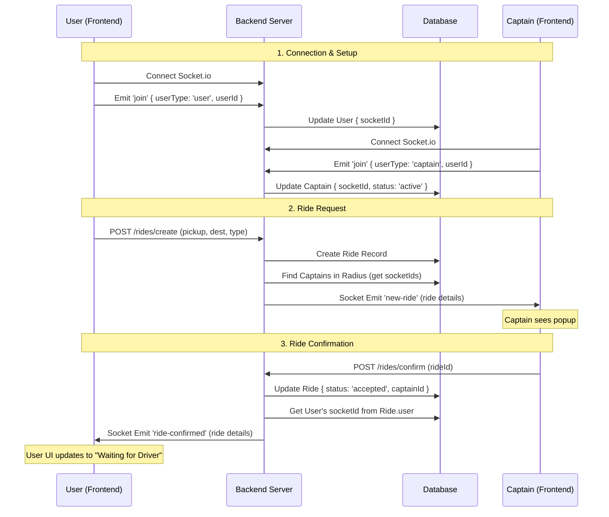

# Socket Architecture & Testing Guide

## 1. Overview
Real-time communication is handled by **Socket.io**. The frontend opens a socket connection to the backend, and clients emit a `join` event (with their id/type). The backend records socket IDs in the database and uses them to push events (`new-ride`, `ride-confirmed`, `ride-started`). HTTP (axios) is used for REST actions (create/confirm rides), while sockets deliver real-time notifications.

## 2. Sequence Diagram
This diagram shows the "Happy Path" where a user requests a ride and a captain accepts it.



## 3. Manual Testing Checklist
Use two different browsers (or one Incognito window) to simulate User and Captain simultaneously.

- [ ] **1. Login Captain**: Open Browser A. Login as a Captain. Ensure you are on the `CaptainHome` page.
- [ ] **2. Login User**: Open Browser B. Login as a User. Ensure you are on the `Home` page.
- [ ] **3. Check Connections**: Look at the server terminal logs. You should see:
    - `Client connected: <socket_id>` (twice)
    - `User <id> joined with socketId: ...`
    - `Captain <id> joined with socketId: ...`
- [ ] **4. Request Ride**: In Browser B (User), enter pickup/destination and click "Find Trip". Select a vehicle type and click "Order".
- [ ] **5. Verify Notification**: In Browser A (Captain), a popup should **immediately** appear with the ride details.
- [ ] **6. Accept Ride**: In Browser A (Captain), click "Accept" (or "Confirm").
- [ ] **7. Verify Confirmation**: In Browser B (User), the "Looking for Driver" panel should disappear and change to "Waiting for Driver" (showing the captain's details).

## 4. Code Trace: Ride Creation & Confirmation

### Phase A: User Creates Ride (`POST /rides/create`)
**File:** `Backend/controllers/ride.controller.js`

1.  **HTTP Request Received**: The user clicks "Order", sending a POST request.
2.  **Business Logic**: The controller calls `rideService.createRide` to save the ride to MongoDB.
3.  **Find Captains**: It calculates coordinates and queries the DB for captains nearby.
4.  **Socket Trigger**: It iterates through found captains and sends the message.

```javascript
// Backend/controllers/ride.controller.js
// ...
        // 6. NOTIFY CAPTAINS VIA SOCKET
        captainsInRadius.map(captain => {
            sendMessageToSocketId(captain.socketId, {
                event: 'new-ride',      // The event name the frontend listens for
                data: rideWithUser      // The payload (ride details)
            })
        })
// ...
```

### Phase B: Captain Confirms Ride (`POST /rides/confirm`)
**File:** `Backend/controllers/ride.controller.js`

1.  **HTTP Request Received**: Captain clicks "Confirm" on the popup.
2.  **Business Logic**: `rideService.confirmRide` updates the ride status to `accepted` and assigns the captain.
3.  **Socket Trigger**: The controller looks up the User's socket ID (stored on the ride's user object) and notifies them.

```javascript
// Backend/controllers/ride.controller.js
// ...
        // 2. NOTIFY USER VIA SOCKET
        sendMessageToSocketId(ride.user.socketId, {
            event: 'ride-confirmed', // The event name the frontend listens for
            data: ride               // The payload (updated ride with captain details)
        })
// ...
```
